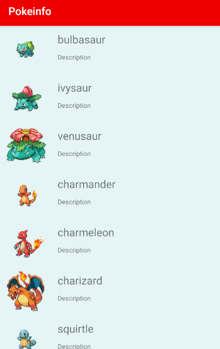
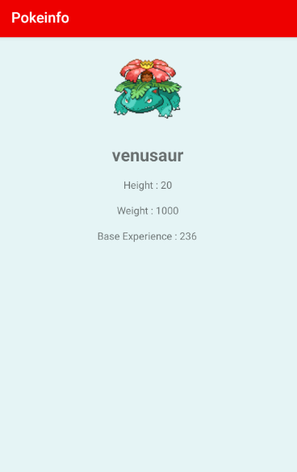

# PokeInfo
**by Minix**

Voici ma petite application, elle récupère des informations des Pokémon depuis [PokéApiV2](https://pokeapi.co/).
Développé avec **Android Studio** en Java.

## Consignes respectées

 - 3 Ecrans : 3 activités  
 - Pattern MVC ( Model, View, Controller)
 - Appels REST
 - Stockage de données en cache
 - Affichage d'une Liste avec un RecylcerView
 - Changement d'activité lors de l'appui sur un élément de la liste 
 - Singletons
 - Affichage des informations de l'API sur 2 activités
 - Gitflow Différente branches Master et Développement

## Fonctionnalités

 - Page de démarrage (1ère Activité) :

 L'activité comprend le logo de l'application ainsi qu'une ProgessBar.
 
 
 
 - Liste des Pokémon (2ème Activité) :
 
Affichage de la liste des pokémon via le RecyclerView elle comprend le nom du pokemon ainsi que sont image qui sont tout les deux récupérés via les API et on pourrais ajouté une description comme écrit.

 - Informations d'un Pokémon (3ème Activité) :   

 En cliquant sur un Pokémon vous retrouverez le nom et l'image encore mais aussi  la hauteur, la largeur et l'expérience de base du Pokémon.

## Problèmes rencontrés :

 - Communication avec la troisième activité  
 - Récupération des informations Stats et Type 

## Conclusion
Pour conclure ce projet m'a permis de découvrir les bases d'android studio ainsi que le fonctionnement des applications mobiles et enfin le fonctionnement d'une API Rest
